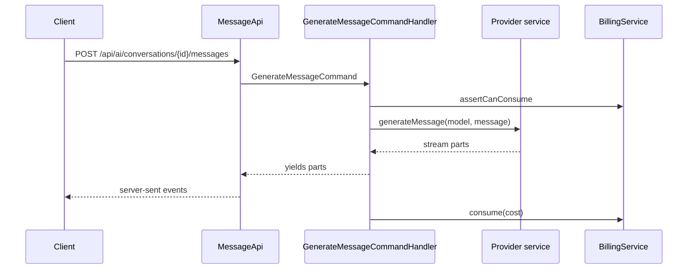

Everything AI-related goes through one indirection: ask the factory for a capability and a model, and get back a service that supports it. Providers are interchangeable, and a plugin can add more.

## Resolving a service

```php
use Ai\Domain\Completion\MessageServiceInterface;
use Ai\Domain\Services\AiServiceFactoryInterface;

$service = $this->factory->create(MessageServiceInterface::class, $model);
```

The factory walks its registered services, resolves each from the container, and returns the first that implements the requested interface and reports `supportsModel($model)`. If nothing matches, it throws.

Every service implements `Ai\Domain\Services\AiServiceInterface`:

```php
public function supportsModel(Model $model): bool;
public function getSupportedModels(): Traversable;
```

## Capabilities

| Interface | Method |
| --- | --- |
| `Completion\MessageServiceInterface` | `generateMessage()`, returns a `Generator` of stream parts |
| `Completion\TextCompletionServiceInterface` | `complete()`, a single instruction and input |
| `Image\ImageServiceInterface` | `generateImage()` |
| `Video\VideoServiceInterface` | `generateVideo()`, often asynchronous |
| `Speech\SpeechServiceInterface` | `getVoiceList()`, `generateSpeech()` |
| `Speech\VoiceCloningServiceInterface` | `cloneVoice()`, `deleteVoice()` |
| `Transcription\TranscriptionServiceInterface` | `generateTranscription()` |
| `Classification\ClassificationServiceInterface` | `generateClassification()` |
| `Embedding\EmbeddingServiceInterface` | `generateEmbedding()` |
| `IsolatedVoice\VoiceIsolatorServiceInterface` | `generateIsolatedVoice()` |

## Bundled providers

Registered during boot: OpenAI, Anthropic, Cohere, xAI, Google, Azure, ElevenLabs, Speechify, Stability AI, Clipdrop, Fal.ai, Luma, Ollama, and a generic adapter for OpenAI-compatible servers. Each implements the capabilities its API supports.

Video generation is asynchronous at several providers, which is why the application exposes provider-specific webhook endpoints that complete a generation when the provider calls back.

## The model registry

What users can select comes from the registry, not from the services:

| File | Role |
| --- | --- |
| `config/registry/base.json` | The catalog shipped with the release |
| `config/registry/registry.json` | Per-installation customizations, not shipped, so updates preserve it |
| `config/registry/import.json` | Importable models for bundled providers |
| `config/registry/servers.json` | Importable OpenAI-compatible servers |
| `config/registry/schema.json` | The JSON schema for the above |

At boot, `base.json` is loaded and `registry.json` is merged over it, matching services and models by key.

<Warning>
  Services and models that don't exist in `base.json` survive the merge only when marked `"custom": true`. That flag is what lets an administrator's custom server, or a plugin's models, persist.
</Warning>

A model entry carries its key, type, name, a cost multiplier, modalities, capability specs, the rate keys it bills under, and UI configuration such as prompt length and accepted images.

## Chat generation



The handler returns a generator, and the request handler streams it. Parts are also folded into the stored message, so reloading the conversation shows the same content.

### Stream parts

| Part | Meaning |
| --- | --- |
| `TextDeltaPart` | The next chunk of the answer |
| `ReasoningDeltaPart`, `ReasoningSectionStartPart` | Reasoning output |
| `ToolStartPart`, `ToolArgsPart`, `ToolCallPart`, `ToolResultPart` | A tool being called and returning |
| `SourcePart` | A cited source |
| `LibraryItemPart` | Something generated and saved, such as an image |
| `UsagePart` | The running cost total |
| `ErrorPart` | Generation failed |
| `FinishPart` | The stream is done |

Only some of these are forwarded to the browser; the rest are internal. See the [REST API overview](/development/api/overview) for the client-visible events.

## Tools

Tools are what a model can call mid-answer: web search, page fetching, YouTube lookups, media generation, transcription, knowledge base and embedding search, memories and chat history, canvas documents, follow-up questions and voice selection.

They're held in a collection, and filtered per message: the tool must be enabled, allowed by the workspace's plan, and not disabled by the user. Temporary conversations exclude the tools that would leave state behind.

A tool returns its textual result plus its cost, which is added to the generation's total. See [AI tools](/development/plugins/guides/ai-tool).

## Embeddings and knowledge bases

Uploaded documents and links are chunked, embedded, and stored in a vector store. The default store keeps vectors as files in the configured storage; an alternative can be selected from the registered stores. Search is scoped by namespace and by the dataset units attached to the conversation. See [Vector stores](/development/plugins/guides/vector-store).

Documents are parsed by a reader stack that handles PDF, Word, HTML, XML, JSON, YAML, CSV and plain text.

## Credits

`Ai\Infrastructure\Services\CostCalculator` converts provider usage into credits using the installation's configured rates, which are keyed per model and per rate type such as input, output or image. The lifecycle is:

<Steps>
  <Step title="Estimate">
    `estimate($model)` returns the model's multiplier as a pre-flight figure.
  </Step>
  <Step title="Reserve">
    `BillingService::reserve()` holds the estimate so concurrent work can't overspend.
  </Step>
  <Step title="Generate">
    The provider call runs.
  </Step>
  <Step title="Release and consume">
    The reservation is released, and the real cost is consumed, which dispatches a credit usage event.
  </Step>
</Steps>

When a workspace brings its own provider key, the billing service skips deduction, which is why the model is always passed alongside the workspace.

## Related

- [Billing subsystem](/development/core/billing-subsystem)
- [AI providers guide](/development/plugins/guides/ai-provider)
- [AI models and credits](/development/plugins/ai-models-and-credits)
- [Unified credit system](/billing/unified-credit-system)
