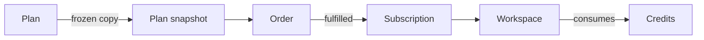

Billing ties together what a customer bought, what their workspace may do, and how much of it they've used.

## The model

| Entity | Role |
| --- | --- |
| `PlanEntity` | What's for sale: price, cycle, credits, capabilities, features |
| `PlanSnapshotEntity` | A frozen copy taken when someone buys, so later plan edits don't rewrite history |
| `OrderEntity` | One purchase: currency, totals, tax, coupon, gateway, status |
| `SubscriptionEntity` | Ongoing access: usage, renewal dates, the provider's reference |
| `CouponEntity` | A discount, optionally limited to a number of cycles |

## Enumerations

| Enum | Values |
| --- | --- |
| `BillingCycle` | `one-time`, `monthly`, `yearly`, `lifetime` |
| `OrderStatus` | `draft`, `pending`, `failed`, `processing`, `completed`, `cancelled` |
| `SubscriptionStatus` | `active`, `trialing`, `canceled`, `ended`, `unknown` |

`BillingCycle` also answers two questions the rest of the system asks: whether the cycle recurs, and whether it renews.

## What a plan grants

`PlanConfig` is the capability side of a plan: per-feature settings for chat, writer, imagine, video, transcription, voice-over, voice isolation and classification, plus allowed models, tool switches, allowed assistants and templates, and an `extensions` map plugins can add to.

Because a snapshot carries the config, a subscription keeps the capabilities it was sold with. See [Plan config extensions](/development/plugins/guides/plan-config-extension).

## Credits

Credits live on the workspace, in three places:

| Field | Meaning |
| --- | --- |
| Subscription credits | Granted by the plan, reset each period |
| Add-on credits | Bought separately, or granted by a one-time plan |
| Session credits | Used in session billing mode |

A `null` credit count means unlimited. Deduction takes from the subscription first, then the add-on balance.

`BillingService` is the gate everything goes through:

| Method | Purpose |
| --- | --- |
| `assertCanConsume()` | Throws when the workspace can't spend right now |
| `reserve()` | Holds an estimate for the duration of a call |
| `release()` | Returns a held estimate |
| `consume()` | Charges the real cost and dispatches a credit usage event |

Relevant options: `option.billing.usage_mode`, which is either unpaced or session-based, and `option.billing.negative_balance_enabled`.

## Purchase flow

<Steps>
  <Step title="Order">
    Creating an order snapshots the plan, applies a coupon, and asks the configured tax engine for tax lines.
  </Step>
  <Step title="Payment">
    The selected gateway starts the payment, and the user is redirected or shown an embedded form.
  </Step>
  <Step title="Confirmation">
    On return, the gateway verifies the payment and hands back a provider reference. The order is paid.
  </Step>
  <Step title="Fulfilment">
    For a recurring plan, a subscription is created from the order, carrying the reference and the gateway. For a one-time plan, credits are added to the workspace. Any previous subscription is cancelled.
  </Step>
</Steps>

The full sequence, including webhooks, is in [Payment gateways](/development/plugins/guides/payments/overview).

## Renewals

A cron listener renews subscriptions that are due, in batches, tracking its position in an option. Renewal resets usage, settles any credit debt, and moves the next reset 30 days out, then dispatches a usage reset event.

<Warning>
  Renewal resets usage; it doesn't charge anyone. Either the provider bills on its own schedule, or a gateway plugin charges when the usage reset event fires.
</Warning>

Cancelling sets the subscription to end at its next renewal date and asks the gateway to cancel at the provider. A second cron listener ends expired subscriptions, moving the workspace to the plan configured as `option.billing.fallback_plan`.

## Payment gateways

Gateways are registered in a factory, keyed by a lookup key, and implement a small interface for purchase, completion, cancellation and webhooks. Marker interfaces describe how the gateway is presented and whether it supports a given plan. Aikeedo ships Stripe, PayPal, bank transfer and manual payment.

## Tax

A tax engine calculates lines when an order is created, and the result is stored on the order, so gateways charge the taxed total without extra work. The selected engine comes from `option.billing.tax_engine`, falling back to a no-op engine. See [Tax engines](/development/plugins/guides/tax-engine).

## Currency

Plans are priced in the platform currency. When a gateway bills in another one, a helper converts through the configured rate provider, and silently falls back to the original amount if conversion fails. See [Currency rate providers](/development/plugins/guides/currency-rate-provider).

## Commands

| Command | Purpose |
| --- | --- |
| `CreateOrderCommand` | Start a purchase, including snapshot, coupon and tax |
| `PayOrderCommand` | Record payment with a gateway reference |
| `FulfillOrderCommand` | Grant the plan or credits |
| `CancelSubscriptionCommand` | End at period end, and tell the gateway |
| `EndSubscriptionCommand` | End now, and apply the fallback plan |
| `RenewSubscriptionCommand` | Reset usage for a due subscription |
| `ReadSubscriptionCommand::createByExternalId()` | Find a subscription from a webhook |

## Related

- [Payment gateways](/development/plugins/guides/payments/overview)
- [AI subsystem](/development/core/ai-subsystem)
- [Plans, snapshots and subscriptions](/billing/plans-snapshots-subscriptions)
- [Unified credit system](/billing/unified-credit-system)
