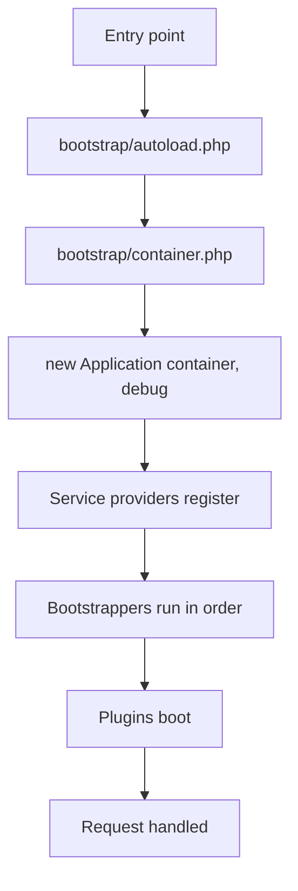
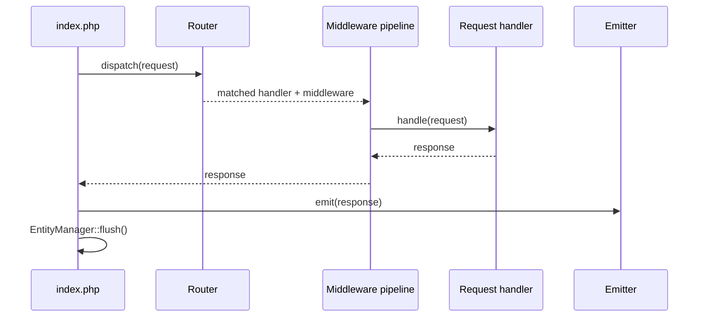

Every entry point, web, console or cron, runs the same bootstrap. Knowing its order explains why plugins can rely on core services, and why database changes are saved after the response is sent.

## Entry points

| Entry point | Used by |
| --- | --- |
| `public/index.php` | Every HTTP request |
| `bin/console` | Console commands |
| `cron.php` | Scheduled work |

All three include `bootstrap/app.php` and get back a configured container.

## Boot sequence

<Steps>
  <Step title="Autoloading">
    `bootstrap/autoload.php` loads Composer's autoloader and maps the application's namespaces to `src/`. Application classes have no vendor prefix, so `Billing\Domain\Entities\OrderEntity` lives at `src/Billing/Domain/Entities/OrderEntity.php`.
  </Step>
  <Step title="Container and configuration">
    `bootstrap/container.php` loads `.env`, falling back to `.env.example`, builds the configuration object, registers the configuration resolver, and loads the provider, bootstrapper, command and migration lists.
  </Step>
  <Step title="The application object">
    `new Application($container, DEBUG)` configures error reporting, promotes warnings to exceptions, sets the timezone to UTC, and stores a static container so `Application::make()` works anywhere.
  </Step>
  <Step title="Service providers">
    Each provider registers low-level services: logging, caching, events, HTTP factories, the HTTP client, the service collection, the emitter and router, and the Twig environment.
  </Step>
  <Step title="Bootstrappers">
    Module bootstrappers run in a fixed order. They bind repository interfaces to Doctrine implementations, register navigation, wire event listeners, and populate the registries: AI services, tools, payment gateways, storage adapters and more.
  </Step>
  <Step title="Plugins">
    The plugin bootstrapper runs near the end, so every core registry exists before a plugin's `boot()` is called. The active theme's template namespace is registered here too.
  </Step>
  <Step title="Request handling">
    For HTTP, the request is built from globals, dispatched through the router and middleware pipeline, and the response is emitted.
  </Step>
  <Step title="Flush">
    After the response is emitted, the entity manager is flushed once, which is when database changes are written.
  </Step>
</Steps>

## Providers

Providers run first, in this order:

| Provider | Registers |
| --- | --- |
| `LoggerServiceProvider` | Monolog handlers writing to `var/log` |
| `CacheServiceProvider` | Filesystem PSR-6 and PSR-16 caches in `var/cache` |
| `EventServiceProvider` | The PSR-14 dispatcher and its listener mappers |
| `HttpFactoryServiceProvider` | PSR-17 request, response and stream factories |
| `HttpClientServiceProvider` | The PSR-18 HTTP client |
| `ServiceCollectionProvider` | The keyed service registry |
| `HttpServiceProvider` | The response emitter and the router dispatcher |
| `ViewEngineProvider` | Twig, its loader paths and extensions |

They're listed in `config/providers.php`.

## Bootstrappers

`config/bootstrappers.php` fixes the order:

1. `FileSystemBootstrapper` and `DoctrineBootstrapper`, so storage and the database exist first.
2. `OptionModuleBootstrapper`, which makes settings resolvable as `option.*` container IDs.
3. The domain modules: user, workspace, dataset, category, preset, billing, voice, AI, import, statistics, assistant, affiliate, file, chatbot.
4. `ConsoleBootstrapper`, `RoutingBootstrapper`, `MailerBootstrapper`.
5. `PluginModuleBootstrapper`, which loads plugins and the active theme.
6. `PreferencesBootstrapper`, which resolves the chosen vector store and rate provider from what's now registered.

<Note>
  This order is why a plugin can register a payment gateway or an AI service in `boot()`: the registries it adds to were created by bootstrappers that already ran.
</Note>

## Configuration resolution

Two resolvers make configuration injectable by ID:

| Prefix | Source |
| --- | --- |
| `config.*` | Paths and flags computed at bootstrap, such as `config.dirs.root` and `config.enable_caching` |
| `option.*` | Rows in the options table, decoded from JSON into a dot map |

If the database isn't configured yet, option resolution returns nothing rather than failing, which is what lets the installer run.

## Request handling

Route parameters become request attributes, and middleware is assembled from the handler's class hierarchy, outermost first. See [Routing and middleware](/development/core/routing-and-middleware).

## Persistence timing

Handlers call repository methods and entity setters; nothing is written until the flush at the end. That has three consequences worth remembering:

- A handler can build and modify entities freely without worrying about partial writes.
- A response is emitted **before** the flush, so a failure there can't be reported to the client.
- Long-running work, such as a streamed response, must flush explicitly if it needs data persisted mid-request.

Console commands and the cron entry point flush as well.

## Theme preview

Before the application boots, `bootstrap/app.php` looks for a preview cookie. When it names an installed theme, the active theme is overridden for that request only, which is how `/preview?theme=...` works without changing the live site.

## Related

- [Dependency injection](/development/core/dependency-injection)
- [Configuration](/development/core/configuration)
- [Routing and middleware](/development/core/routing-and-middleware)
- [Plugin lifecycle](/development/plugins/lifecycle-and-hooks)
