import DevVersionNote from '/snippets/dev-version-note.mdx';

Aikeedo is a PHP application assembled from small PSR components rather than a full-stack framework. Reading this section pays off when you're writing a non-trivial plugin, tracing a bug, or deciding how to customize something safely.

<DevVersionNote />

## Technology

| Concern | Choice |
| --- | --- |
| Language | PHP 8.2+, with the `intl`, `gd` and `bcmath` extensions |
| HTTP | PSR-7 messages and PSR-15 middleware, with Laminas Diactoros |
| Container | A small autowiring container with attribute-based injection |
| Routing | Attributes on request handler classes |
| Events | PSR-14, dispatched synchronously |
| Persistence | Doctrine ORM 3 and Doctrine Migrations on MySQL, with binary UUIDv7 IDs |
| Views | Twig 3, with gettext, Intl and Markdown extensions |
| HTTP client | PSR-18, backed by Symfony HttpClient |
| Console | Symfony Console |
| Cache and logs | Symfony Cache on the filesystem, and Monolog |
| Frontend | Alpine.js 3, Tailwind CSS 4 and Vite 8 |

## Design principles

<AccordionGroup>
  <Accordion title="Bounded contexts">
    `src/` is split by domain rather than by technical layer: `Ai`, `Billing`, `User`, `Workspace`, `Chatbot` and so on. Each owns its entities, repositories, commands and events.
  </Accordion>
  <Accordion title="Commands over services">
    Behavior is expressed as a command plus a handler, dispatched through a bus. Reads use the same mechanism, so `ListPlansCommand` and `CreateOrderCommand` look alike from the outside.
  </Accordion>
  <Accordion title="Value objects at the edges">
    Entities take value objects, not scalars. Validation lives in the value object's constructor, so an invalid `Email` or `Price` can't exist.
  </Accordion>
  <Accordion title="Registries for extensibility">
    Payment gateways, tax engines, storage adapters, vector stores, AI services and tools are all looked up from registries a plugin can add to.
  </Accordion>
  <Accordion title="One flush per request">
    Handlers change entities; the application flushes once, after the response is sent.
  </Accordion>
</AccordionGroup>

## The modules

| Module | Responsibility |
| --- | --- |
| `Ai` | Conversations, messages, generation, tools, embeddings, the model registry |
| `Assistant` | Assistant definitions |
| `Billing` | Plans, snapshots, orders, subscriptions, coupons, credits, gateways, tax |
| `Workspace` | Workspaces, members, invitations, credit balances |
| `User` | Accounts, authentication, preferences, single sign-on |
| `Affiliate` | Referrals, balances, payouts |
| `Category`, `Preset` | Content templates and their categories |
| `Chatbot` | Chatbot entities used by the chatbots feature |
| `Dataset` | Knowledge base sources and data units |
| `File` | File entities and image metadata |
| `Import` | Import jobs and migration adapters |
| `Option` | Settings storage and resolution |
| `Plugin` | Plugin and theme discovery, loading and lifecycle |
| `Presentation` | HTTP: request handlers, middleware, responses, resources, console commands |
| `Shared` | Container glue, command bus, filesystem, i18n, navigation, caching, registries |
| `Stat`, `Cron`, `Voice` | Statistics, scheduled work, voices |

## Request lifecycle in brief

```mermaid
flowchart LR
    A[public/index.php] --> B[bootstrap/app.php]
    B --> C[Container and configuration]
    C --> D[Service providers]
    D --> E[Module bootstrappers]
    E --> F[Plugins boot]
    F --> G[Route dispatch]
    G --> H[Middleware pipeline]
    H --> I[Request handler]
    I --> J[Command bus]
    J --> K[Domain and repositories]
    K --> L[Response emitted]
    L --> M[EntityManager flush]
```

Each step is covered in [Bootstrap and lifecycle](/development/core/bootstrap-and-lifecycle) and [Routing and middleware](/development/core/routing-and-middleware).

## Where to go next

<CardGroup cols={2}>
  <Card title="Directory structure" icon="folder-tree" href="/development/core/directory-structure">
    What lives where in an installation.
  </Card>
  <Card title="Modules and layers" icon="layer-group" href="/development/core/modules-and-layers">
    Domain, application and infrastructure inside a module.
  </Card>
  <Card title="Events" icon="tower-broadcast" href="/development/core/events">
    The full catalog of domain events.
  </Card>
  <Card title="AI subsystem" icon="robot" href="/development/core/ai-subsystem">
    Services, models, streaming and credits.
  </Card>
</CardGroup>

import Support from '/snippets/support.mdx';

<Support />
