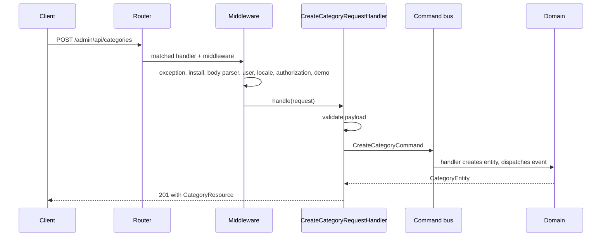

Routes aren't declared in a file. Each request handler carries attributes describing its path, method and middleware, and the router discovers them by scanning `src/` plus any directory a plugin or theme registers.

## Discovery

At bootstrap, an attribute mapper scans the source directory for classes with route attributes. The result is cached when `CACHE=true` and `DEBUG=false`.

```php
use Easy\Router\Mapper\AttributeMapper;

$mapper->addPath(__DIR__);
```

That's also how plugins and themes add their own handlers. See [Routes and request handlers](/development/plugins/routes-and-request-handlers).

<Warning>
  A new route on a cached installation isn't visible until the cache is cleared. Development should run with `CACHE=false`.
</Warning>

## Attributes

```php
#[Path('/notes')]
#[Route(path: '/', method: RequestMethod::GET)]
#[Route(path: '/[uuid:id]', method: RequestMethod::PATCH, priority: Priority::HIGH)]
#[Middleware(SomeMiddleware::class)]
```

| Attribute | Effect |
| --- | --- |
| `Easy\Router\Attributes\Route` | Declares a path, an HTTP method and an optional priority. Repeatable. |
| `Easy\Router\Attributes\Path` | A prefix for the class and everything extending it. |
| `Easy\Router\Attributes\Middleware` | Adds PSR-15 middleware, outermost first. Repeatable. |

### Path syntax

| Pattern | Matches |
| --- | --- |
| `/notes` | Exactly that path |
| `/[:slug]` | One segment, exposed as the `slug` attribute |
| `/[uuid:id]` | A UUID segment |
| `/[images\|videos:type]` | One of the listed values |
| `/[locale:locale]?/pricing` | An optional locale prefix, such as `/de-DE` |

`locale` is a custom match type registered at bootstrap, matching language codes like `en-US`.

Route parameters arrive as request attributes:

```php
$id = $request->getAttribute('id');
```

Higher priorities are matched first, which is how a specific route beats a catch-all.

## Groups

Handlers inherit their prefix and middleware from the class they extend:

| Base class | Prefix | Middleware added |
| --- | --- | --- |
| `Presentation\RequestHandlers\AbstractRequestHandler` | none | Exception, Install, RequestBodyParser, User, Locale |
| `…\Api\Api` | `/api` | + Authorization, EmailVerification, Byok |
| `…\App\AppView` | `/app` | + Authorization, EmailVerification, View |
| `…\App\Billing\BillingView` | `/app/billing` | inherits `AppView` |
| `…\Admin\AbstractAdminRequestHandler` | `/admin` | + Authorization, admin role required |
| `…\Admin\AbstractAdminViewRequestHandler` | `/admin` | + DemoEnvironment, License, View |
| `…\Admin\Api\AdminApi` | `/admin/api` | + DemoEnvironment |

Handlers that extend none of these get a root path and no middleware at all, which is what webhook and embed endpoints use deliberately.

## The middleware pipeline

| Middleware | Responsibility |
| --- | --- |
| `ExceptionMiddleware` | Converts exceptions into responses, logs unhandled ones |
| `InstallMiddleware` | Routes everything to the installer while `ENVIRONMENT=install` |
| `RequestBodyParserMiddleware` | Parses JSON and form bodies into an object |
| `UserMiddleware` | Resolves the user from a token, cookie or API key, and the workspace |
| `LocaleMiddleware` | Resolves the language and loads translation catalogs |
| `AuthorizationMiddleware` | Requires an active user, and the admin role under `/admin` |
| `EmailVerificationMiddleware` | Enforces a strict verification policy |
| `ByokMiddleware` | Applies workspace-provided provider keys |
| `ViewMiddleware` | Renders a `ViewResponse` and injects template globals |
| `DemoEnvironmentMiddleware` | Blocks writes in demo mode |
| `LicenseMiddleware` | Gates admin views behind license verification |
| `CaptchaMiddleware` | Validates captcha tokens where enabled |
| `ClientIpMiddleware` | Resolves the client IP behind proxies |

Middleware from a parent class runs before a child's, so the outermost layer is always error handling.

## A request end to end

`POST /admin/api/categories`:



After the response is emitted, the entity manager is flushed.

## Responses

| Class | Use |
| --- | --- |
| `Presentation\Response\JsonResponse` | JSON payloads |
| `Presentation\Response\ViewResponse` | A Twig template plus data |
| `Presentation\Response\RedirectResponse` | Redirects |
| `Presentation\Response\HtmlResponse` | Raw HTML |
| `Presentation\Response\EmptyResponse` | No body |
| `Presentation\Response\Response` | A PSR-7 response you build yourself, including streams |

## Errors

`ExceptionMiddleware` maps exceptions to responses:

| Exception | Response |
| --- | --- |
| `ValidationException` | `400` with `code`, `message` and `param` |
| `UnauthorizedException` | `401` JSON on API paths, a redirect to `/login` elsewhere |
| `UsageLimitException`, `InsufficientCreditsException` | `403` |
| `HttpException` and its subclasses, such as `NotFoundException` | The status code it carries, defaulting to `422` |
| `InvalidValueException` | `400` |
| Anything else | Logged with a correlation ID, `500` JSON on API paths, an empty `500` elsewhere |

With `DEBUG` on, unhandled exceptions are rethrown instead, so you see the stack trace.

## Related

- [Authentication and authorization](/development/core/authentication-and-authorization)
- [Views and frontend](/development/core/views-and-frontend)
- [Plugin routes and handlers](/development/plugins/routes-and-request-handlers)
