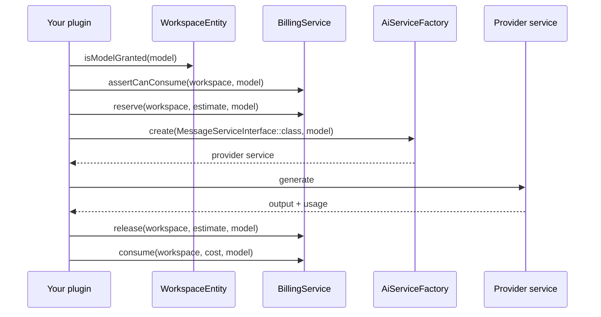

A plugin can use the AI services the installation already has configured, instead of holding its own API keys. Aikeedo resolves a service for the model, and the billing service handles credits.

## The flow



Reserving before the call stops a workspace from starting more work than its balance allows, then you release the estimate and consume the real cost once you know it.

## Check access first

```php
use Ai\Domain\Exceptions\ModelNotAccessibleException;
use Ai\Domain\ValueObjects\Model;

$model = new Model('gpt-4o');

if (!$workspace->isModelGranted($model)) {
    throw new ModelNotAccessibleException($model->value);
}

// Throws when the workspace is out of credits or past its usage window.
$this->billing->assertCanConsume($workspace, $model);
```

`isModelGranted()` reflects the workspace's plan. `assertCanConsume()` throws `Ai\Domain\Exceptions\InsufficientCreditsException` or `Billing\Domain\Exceptions\UsageLimitException`, which the exception middleware turns into a `403`.

## Resolve a service

```php
use Ai\Domain\Completion\TextCompletionServiceInterface;
use Ai\Domain\Services\AiServiceFactoryInterface;

public function __construct(
    private AiServiceFactoryInterface $factory,
) {}

$service = $this->factory->create(TextCompletionServiceInterface::class, $model);

$response = $service->complete(
    $model,
    'You summarize notes in one sentence.',
    $noteBody,
    maxTokens: 256,
);
```

The factory returns the first registered service that implements the interface and supports the model, and throws when nothing matches.

| Capability interface | Use for |
| --- | --- |
| `Ai\Domain\Completion\TextCompletionServiceInterface` | A single prompt-and-answer completion |
| `Ai\Domain\Completion\MessageServiceInterface` | Streamed chat, returns a `Generator` of stream parts |
| `Ai\Domain\Image\ImageServiceInterface` | Image generation |
| `Ai\Domain\Video\VideoServiceInterface` | Video generation |
| `Ai\Domain\Speech\SpeechServiceInterface` | Text to speech |
| `Ai\Domain\Transcription\TranscriptionServiceInterface` | Speech to text |
| `Ai\Domain\Classification\ClassificationServiceInterface` | Classification |
| `Ai\Domain\Embedding\EmbeddingServiceInterface` | Embeddings |
| `Ai\Domain\IsolatedVoice\VoiceIsolatorServiceInterface` | Voice isolation |

## Bill the usage

```php
use Ai\Infrastructure\Services\CostCalculator;

public function __construct(
    private CostCalculator $calculator,
    private BillingService $billing,
) {}

$estimate = $this->calculator->estimate($model);

$this->billing->reserve($workspace, $estimate, $model);

try {
    $response = $service->complete($model, $instructions, $input);
} finally {
    // Always give the reservation back, then charge what it really cost.
    $this->billing->release($workspace, $estimate, $model);
}

$this->billing->consume($workspace, $response->cost, $model);
```

Most service responses carry the cost the provider service already calculated, such as `TextCompletionResponse::$cost`, so you rarely compute it yourself.

| Method | Effect |
| --- | --- |
| `assertCanConsume(WorkspaceEntity, ?Model)` | Throws if the workspace can't spend right now |
| `reserve(WorkspaceEntity, CreditCount, ?Model)` | Holds an estimated amount for the duration of the call |
| `release(WorkspaceEntity, CreditCount, ?Model)` | Returns the held amount |
| `consume(WorkspaceEntity, CreditCount, ?Model)` | Charges the real cost and dispatches `CreditUsageEvent` |

<Note>
  Always pass the `Model`. The billing service uses it to decide whether credits apply at all: when the workspace brings its own provider key, nothing is charged.
</Note>

### Cost calculation

Use the calculator when you bill something the core doesn't price for you. `CostCalculator::estimate($model)` returns the model's configured multiplier as a rough pre-flight number, and `CostCalculator::calculate($amount, $model, $opt)` converts real usage into credits using the installation's configured rates. The optional bitmask selects a rate variant, such as `CostCalculator::INPUT`, `CostCalculator::OUTPUT`, `CostCalculator::IMAGE`, `CostCalculator::QUALITY_HD` and the `SIZE_*` constants.

```php
$inputCost = $this->calculator->calculate($inputTokens, $model, CostCalculator::INPUT);
$outputCost = $this->calculator->calculate($outputTokens, $model, CostCalculator::OUTPUT);
```

## Streaming chat

`MessageServiceInterface::generateMessage()` returns a generator of stream parts. Fold them as they arrive, and take the cost from the usage part:

```php
use Ai\Domain\ValueObjects\Stream\TextDeltaPart;
use Ai\Domain\ValueObjects\Stream\UsagePart;
use Billing\Domain\ValueObjects\CreditCount;

$cost = new CreditCount(0);
$text = '';

foreach ($service->generateMessage($model, $message) as $part) {
    if ($part instanceof TextDeltaPart) {
        $text .= $part->delta;
    }

    if ($part instanceof UsagePart) {
        // Each usage part carries the running total, so overwrite it.
        $cost = $part->cost;
    }
}

$this->billing->consume($workspace, $cost, $model);
```

To forward that stream to a browser, see [Streaming responses](/development/plugins/streaming-responses).

## Which models exist

The model registry holds every service and model the installation knows about, including admin customizations:

```php
use Shared\Infrastructure\Services\ModelRegistry;

public function __construct(
    private ModelRegistry $registry,
) {}

foreach ($this->registry['directory'] as $service) {
    foreach ($service['models'] as $model) {
        // $model['key'], $model['name'], $model['type'], $model['enabled']
    }
}
```

Let administrators pick a model in your settings page rather than hardcoding one, and fall back to a related global setting, such as `option.embeddings.model`, where one exists.

## Adding your own provider

Everything above consumes services the core registered. To add a provider, implement a capability interface and register it with the factory. See [AI providers](/development/plugins/guides/ai-provider).

## Related

- [Streaming responses](/development/plugins/streaming-responses)
- [AI providers guide](/development/plugins/guides/ai-provider)
- [AI subsystem internals](/development/core/ai-subsystem)
- [Unified credit system](/billing/unified-credit-system)
