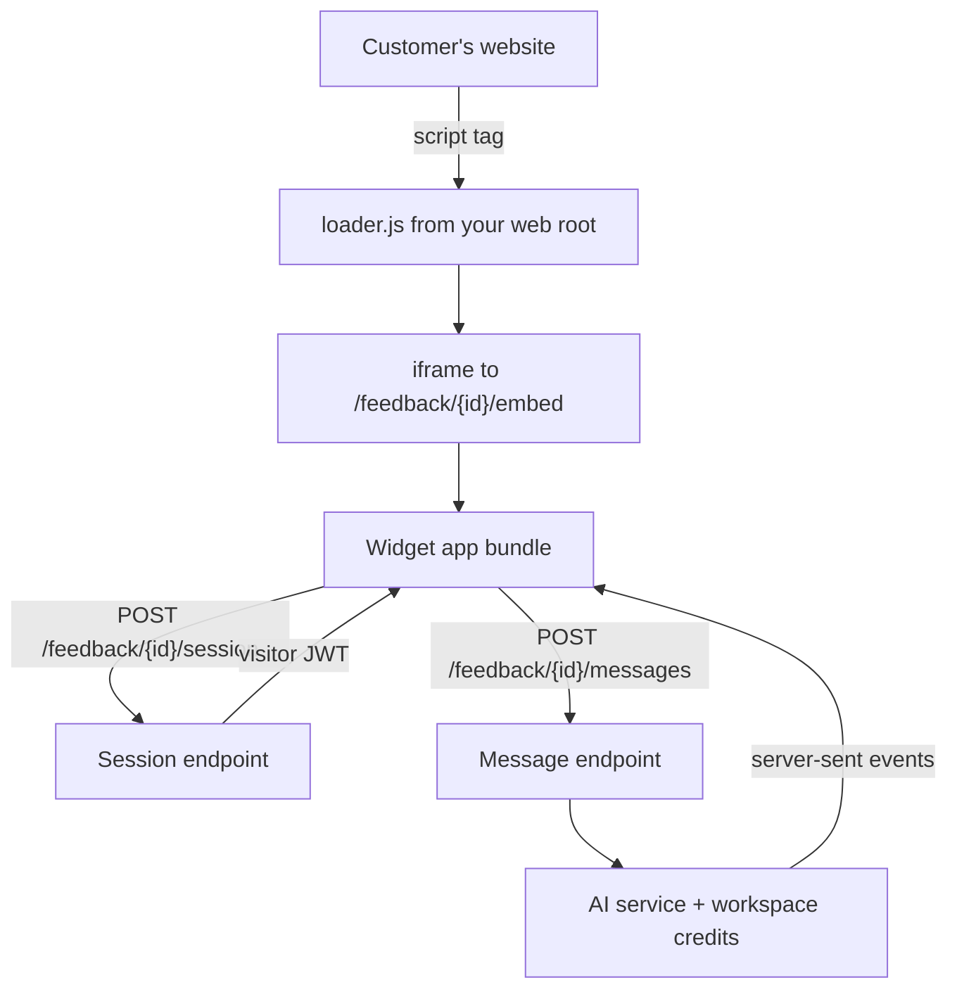

import { OfficialPlugins } from '/snippets/official-plugins.mdx';

This guide combines the public-endpoint, asset, streaming and billing building blocks into one feature: `acme/feedback-widget`, a widget a customer embeds on their own site, where visitors ask questions and get AI-generated answers.

It's the most security-sensitive kind of plugin you can build, so read [Public pages and endpoints](/development/plugins/public-endpoints-and-embeds) first.

## Architecture



| Piece | Where it lives |
| --- | --- |
| Loader script | Published to the web root through `extra.public` |
| Embed page | A public route rendering a standalone HTML page |
| Widget app | A built bundle published under `/e/acme/feedback-widget/` |
| API | Public routes with your own middleware stack |
| Configuration | A widget record per workspace, with a secret and trusted domains |

## 1. Publish the loader

```json composer.json
{
  "require": { "heyaikeedo/composer": "^1.2.0" },
  "extra": {
    "public": [
      { "source": "widget/dist/loader.js", "target": "/acme-feedback.js" },
      { "source": "widget/dist/app/*", "target": "." }
    ]
  }
}
```

The loader ends up at `/acme-feedback.js`, and the app bundle under `/e/acme/feedback-widget/`. The customer embeds one tag:

```html
<script src="https://your-domain.com/acme-feedback.js" data-id="WIDGET_ID" async></script>
```

The loader creates an iframe pointing at your embed route, and communicates with it over `postMessage`:

```javascript widget/src/loader.js
const script = document.currentScript;
const id = script.dataset.id;
const base = new URL(script.src).origin;

const frame = document.createElement('iframe');
frame.src = `${base}/feedback/${id}/embed`;
frame.style.cssText = 'position:fixed;bottom:16px;right:16px;border:0;width:380px;height:560px;';
document.body.appendChild(frame);

window.addEventListener('message', (event) => {
    // Only trust messages from the iframe you created.
    if (event.origin !== base) return;

    if (event.data?.type === 'acme-feedback:resize') {
        frame.style.height = `${event.data.height}px`;
    }
});
```

## 2. Serve the embed page

```php src/RequestHandlers/EmbedView.php
#[Middleware(ExceptionMiddleware::class)]
#[Route(path: '/feedback/[uuid:wid]/embed', method: RequestMethod::GET)]
class EmbedView implements RequestHandlerInterface
{
    public function __construct(
        private Dispatcher $dispatcher,
        private Environment $twig,

        #[Inject('option.features.feedback.is_enabled')]
        private ?bool $isEnabled = false,
    ) {}

    public function handle(ServerRequestInterface $request): ResponseInterface
    {
        if (!$this->isEnabled) {
            throw new NotFoundException();
        }

        $widget = $this->dispatcher->dispatch(
            new ReadWidgetCommand($request->getAttribute('wid'))
        );

        if (!$widget->isActive()) {
            throw new NotFoundException();
        }

        $html = $this->twig->render('@acme-feedback/embed.twig', [
            'widget' => new WidgetResource($widget),
        ]);

        $domains = $widget->getTrustedDomains();

        return (new HtmlResponse($html))->withHeader(
            'Content-Security-Policy',
            'frame-ancestors ' . ($domains ? implode(' ', $domains) : "'none'")
        );
    }
}
```

`frame-ancestors` is the control that actually stops the widget being framed elsewhere. Default to `'none'` when no domains are configured, rather than allowing everything.

The template is a standalone page, not the app layout: `<!DOCTYPE html>`, your bundle, and a JSON config block.

## 3. Authenticate visitors

A visitor isn't an Aikeedo user. Issue a short-lived token, signed with the widget's own secret:

```php src/RequestHandlers/Api/SessionRequestHandler.php
#[Route(path: 'session', method: RequestMethod::POST)]
class SessionRequestHandler extends AbstractWidgetApi implements RequestHandlerInterface
{
    public function handle(ServerRequestInterface $request): ResponseInterface
    {
        $widget = $request->getAttribute(WidgetEntity::class);

        // Always create a fresh visitor. Never accept an id from the caller.
        $visitor = $this->dispatcher->dispatch(new CreateVisitorCommand($widget));

        return new JsonResponse([
            'token' => $this->tokens->issue(
                (string) $widget->getId()->getValue(),
                (string) $visitor->getId()->getValue(),
                (string) $widget->getSecret()->value,
            ),
        ]);
    }
}
```

<Warning>
  If you support identity verification, where the customer's site tells you who the visitor is, require the claim to be signed with the widget secret on the customer's server. Accepting an unsigned identifier lets anyone read another visitor's conversation.
</Warning>

Your middleware then authenticates later requests:

```php src/Middlewares/VisitorMiddleware.php
public function process(ServerRequestInterface $request, RequestHandlerInterface $handler): ResponseInterface
{
    $widget = $request->getAttribute(WidgetEntity::class);
    $header = $request->getHeaderLine('Authorization');

    if (!preg_match('/Bearer\s(\S+)/', $header, $matches)) {
        throw new UnauthorizedException();
    }

    $claims = $this->tokens->parse($matches[1], (string) $widget->getSecret()->value);

    // The token must belong to this widget.
    if (($claims->wid ?? null) !== (string) $widget->getId()->getValue()) {
        throw new UnauthorizedException();
    }

    $visitor = $this->visitors->ofId(new Id($claims->sub));

    return $handler->handle($request->withAttribute(VisitorEntity::class, $visitor));
}
```

## 4. Answer with AI, billed to the owner

The visitor pays nothing; the workspace that owns the widget does.

```php
$workspace = $widget->getWorkspace();
$model = new Model($widget->getModel()->value);

if (!$workspace->isModelGranted($model)) {
    throw new HttpException('This widget is unavailable', StatusCode::SERVICE_UNAVAILABLE);
}

// Throws when the workspace is out of credits.
$this->billing->assertCanConsume($workspace, $model);

$service = $this->factory->create(MessageServiceInterface::class, $model);
```

Stream the answer back as server-sent events, and consume the real cost when the stream finishes:

```php
$response = (new Response())
    ->withHeader('Content-Type', 'text/event-stream')
    ->withHeader('Cache-Control', 'no-cache')
    ->withHeader('X-Accel-Buffering', 'no');

return $response->withBody(new CallbackStream($this->stream(...), $generator, $workspace, $model));
```

See [Streaming responses](/development/plugins/streaming-responses) and [AI models and credits](/development/plugins/ai-models-and-credits) for the details.

## 5. Verify ownership everywhere

Every route below `/feedback/{wid}/` takes an ID from an untrusted caller. Check the whole chain:

```php
$widget = $request->getAttribute(WidgetEntity::class);
$visitor = $request->getAttribute(VisitorEntity::class);

$thread = $this->threads->ofId(new Id($request->getAttribute('tid')));

// The thread must belong to this visitor AND this widget.
if (
    !$thread->getVisitor()->getId()->equals($visitor->getId())
    || !$thread->getWidget()->getId()->equals($widget->getId())
) {
    throw new NotFoundException();
}
```

Checking only the parent, or only the token, is the single most common way a widget leaks one customer's conversations to another.

## 6. Development

Point an environment variable at your bundler while you work:

```twig embed.twig

<script type="module" src="{{ base }}/app.js"></script>
```

Test the embed on a separate local origin, not inside the Aikeedo tab, so you exercise the real cross-origin path.

## Launch checklist

<div className="flex flex-col gap-2">
  <div className="flex gap-2 items-start"><span className="flex h-[1lh] shrink-0 items-center"><Icon icon="square-rounded-check" size="18" /></span><span>`frame-ancestors` is set, and defaults to `'none'` when nothing is configured.</span></div>
  <div className="flex gap-2 items-start"><span className="flex h-[1lh] shrink-0 items-center"><Icon icon="square-rounded-check" size="18" /></span><span>Tokens are signed per widget, short-lived, and never minted from caller-supplied IDs.</span></div>
  <div className="flex gap-2 items-start"><span className="flex h-[1lh] shrink-0 items-center"><Icon icon="square-rounded-check" size="18" /></span><span>Every nested ID is checked against both the visitor and the widget.</span></div>
  <div className="flex gap-2 items-start"><span className="flex h-[1lh] shrink-0 items-center"><Icon icon="square-rounded-check" size="18" /></span><span>Credits are billed to the widget's workspace, and checked before generation starts.</span></div>
  <div className="flex gap-2 items-start"><span className="flex h-[1lh] shrink-0 items-center"><Icon icon="square-rounded-check" size="18" /></span><span>Requests are rate-limited per visitor and per widget, and payload size is capped.</span></div>
  <div className="flex gap-2 items-start"><span className="flex h-[1lh] shrink-0 items-center"><Icon icon="square-rounded-check" size="18" /></span><span>Responses contain nothing internal: no workspace details, no configuration, no other visitors.</span></div>
  <div className="flex gap-2 items-start"><span className="flex h-[1lh] shrink-0 items-center"><Icon icon="square-rounded-check" size="18" /></span><span>Disabling the feature or deactivating the widget returns `404` for every route.</span></div>
  <div className="flex gap-2 items-start"><span className="flex h-[1lh] shrink-0 items-center"><Icon icon="square-rounded-check" size="18" /></span><span>The loader is small, framework-free, and degrades quietly if the iframe fails to load.</span></div>
</div>

## Official chatbots

If you need embeddable AI chatbots rather than a custom widget, the official Chatbots plugin is available on the [Aikeedo Marketplace](https://aikeedo.com/marketplace/):

<OfficialPlugins skus={['chatbots']} />

## Related

- [Public pages and endpoints](/development/plugins/public-endpoints-and-embeds)
- [Streaming responses](/development/plugins/streaming-responses)
- [AI models and credits](/development/plugins/ai-models-and-credits)
- [Public assets](/development/plugins/public-assets)
