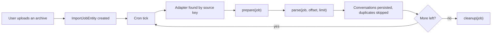

Aikeedo imports conversation archives in the background: a user uploads a file, a job is created, and the cron tick feeds the file through an adapter in batches. A plugin supplies the adapter for a new source.

## How an import runs



The job tracks its own progress, so each tick continues where the last one stopped. Batches are bounded, which keeps a large archive from exhausting memory or time.

## The interface

```php
namespace Import\Domain\Services;

interface MigrationAdapterInterface
{
    public function getName(): string;
    public function getDescription(): string;
    public function supports(FileEntity $file): bool;
    public function prepare(ImportJobEntity $job): void;
    public function parse(ImportJobEntity $job, int $offset = 0, ?int $limit = null): Generator;
    public function cleanup(ImportJobEntity $job): void;
    public function count(FileEntity $file): int;
}
```

| Method | Contract |
| --- | --- |
| `getName()`, `getDescription()` | Shown in the import UI |
| `supports(FileEntity)` | Whether this adapter can read the uploaded file |
| `count(FileEntity)` | How many conversations the archive holds, used for progress |
| `prepare(ImportJobEntity)` | One-time setup per run, such as extracting the archive |
| `parse(ImportJobEntity, int $offset, ?int $limit)` | Yields `ConversationEntity` objects, starting at `$offset` |
| `cleanup(ImportJobEntity)` | Removes temporary files; runs after every batch |

## Yield conversations

Each yielded conversation must carry the source's own identifier in its metadata as `_original_id`. The runner uses it to build a stable external ID, which is how re-running an import skips what's already there.

```php src/NotesAdapter.php
<?php

declare(strict_types=1);

namespace Acme\NotesImport;

use Ai\Domain\Entities\ConversationEntity;
use Ai\Domain\Entities\MessageEntity;
use Ai\Domain\ValueObjects\Content;
use Ai\Domain\ValueObjects\Meta;
use Ai\Domain\ValueObjects\Model;
use Ai\Domain\ValueObjects\Title;
use File\Domain\Entities\FileEntity;
use Generator;
use Import\Domain\Entities\ImportJobEntity;
use Import\Domain\Services\MigrationAdapterInterface;
use Override;
use ZipArchive;

class NotesAdapter implements MigrationAdapterInterface
{
    public const LOOKUP_KEY = 'acme-notes';

    #[Override]
    public function getName(): string
    {
        return 'Acme Notes';
    }

    #[Override]
    public function getDescription(): string
    {
        return 'Import conversations exported from Acme Notes.';
    }

    #[Override]
    public function supports(FileEntity $file): bool
    {
        return str_ends_with((string) $file->getObjectKey()->value, '.zip');
    }

    #[Override]
    public function count(FileEntity $file): int
    {
        return count($this->read($file));
    }

    #[Override]
    public function prepare(ImportJobEntity $job): void
    {
        // Extract once per run, into a working directory under var/.
    }

    #[Override]
    public function parse(
        ImportJobEntity $job,
        int $offset = 0,
        ?int $limit = null
    ): Generator {
        $threads = array_slice(
            $this->read($job->getFile()),
            $offset,
            $limit
        );

        foreach ($threads as $thread) {
            $conversation = new ConversationEntity(
                $job->getWorkspace(),
                $job->getUser(),
                new Title($thread->title),
            );

            // Required: the runner needs it for duplicate detection.
            $conversation->setMeta(new Meta(['_original_id' => $thread->id]));

            foreach ($thread->messages as $message) {
                $conversation->addMessage(
                    $message->role === 'user'
                        ? MessageEntity::userMessage($conversation, new Content($message->text))
                        : MessageEntity::assistantMessage($conversation, new Content($message->text))
                );
            }

            yield $conversation;
        }
    }

    #[Override]
    public function cleanup(ImportJobEntity $job): void
    {
        // Delete anything prepare() created.
    }
}
```

<Note>
  Check the exact constructor and factory signatures of `ConversationEntity` and `MessageEntity` in the source before you build them: they take value objects, and the message factories set the role for you.
</Note>

### Rules

- **Respect `$offset` and `$limit`.** Yielding the whole archive on the first call defeats the batching, and large imports will time out.
- **Yield, don't persist.** The runner persists, deduplicates and counts.
- **Be restartable.** `prepare()` and `parse()` run again on the next tick, so make both safe to repeat.
- **Set `_original_id` on every conversation.** Without it, the conversation is skipped.
- **Keep memory flat.** Stream the archive rather than decoding it all into an array where you can.

## Register the adapter

The runner finds an adapter by matching the job's source against the **key** you registered under, so the key must equal the source value your upload endpoint sets:

```php src/Plugin.php
use Import\Domain\Services\MigrationAdapterInterface;
use Shared\Infrastructure\Collections\ServiceCollectionInterface;

public function boot(Context $context): void
{
    $this->services->add(
        NotesAdapter::LOOKUP_KEY,
        NotesAdapter::class,
        MigrationAdapterInterface::class
    );
}
```

## Create jobs

Give users a page to upload their archive, then create the file and the job:

```php
use Import\Domain\Entities\ImportJobEntity;
use Import\Domain\ValueObjects\ImportSource;

$file = $this->store($request->getUploadedFiles()['file']);

$job = new ImportJobEntity(
    $workspace,
    $user,
    new ImportSource(NotesAdapter::LOOKUP_KEY),
    $file,
);

$this->jobs->add($job);
```

Store the upload with `FileSystemInterface` under `var/`, not the CDN: it's a working file, not something to serve. Poll the job from your page to show progress, and remember that nothing happens until a cron tick runs.

## Testing

<div className="flex flex-col gap-2">
  <div className="flex gap-2 items-start"><span className="flex h-[1lh] shrink-0 items-center"><Icon icon="square-rounded-check" size="18" /></span><span>A small archive imports completely, and conversations appear in the library.</span></div>
  <div className="flex gap-2 items-start"><span className="flex h-[1lh] shrink-0 items-center"><Icon icon="square-rounded-check" size="18" /></span><span>A large archive imports across several cron ticks without timing out.</span></div>
  <div className="flex gap-2 items-start"><span className="flex h-[1lh] shrink-0 items-center"><Icon icon="square-rounded-check" size="18" /></span><span>Re-importing the same archive skips existing conversations instead of duplicating them.</span></div>
  <div className="flex gap-2 items-start"><span className="flex h-[1lh] shrink-0 items-center"><Icon icon="square-rounded-check" size="18" /></span><span>A corrupt archive fails the job with a readable error, rather than looping forever.</span></div>
  <div className="flex gap-2 items-start"><span className="flex h-[1lh] shrink-0 items-center"><Icon icon="square-rounded-check" size="18" /></span><span>Temporary files are removed when the job finishes.</span></div>
</div>

## Related

- [Events and cron](/development/plugins/events-and-cron)
- [Files and storage](/development/plugins/files-and-storage)
- [Background jobs internals](/development/core/background-jobs-and-cron)
