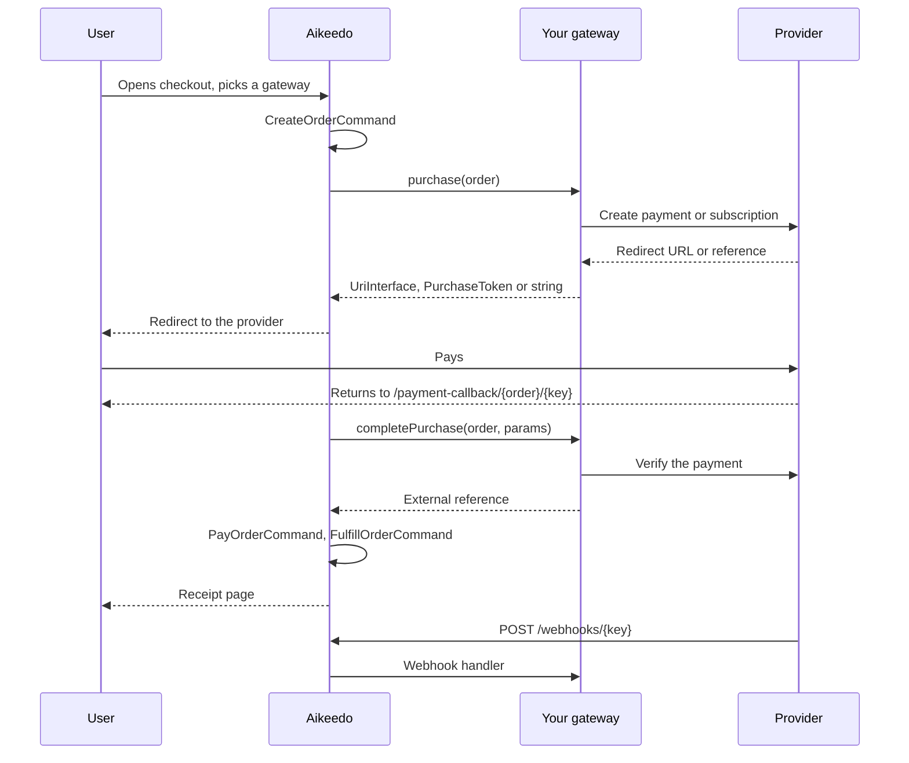

import DevVersionNote from '/snippets/dev-version-note.mdx';

A payment gateway plugin connects Aikeedo's checkout to a payment provider. Aikeedo owns the order, the subscription and the credits; your plugin owns the conversation with the provider.

<DevVersionNote />

## The payment lifecycle

### Step by step

<Steps>
  <Step title="Checkout lists the gateways">
    The checkout page asks the gateway factory for every registered gateway, skips the ones that aren't enabled, and groups the rest: card, crypto, offsite and offline. A gateway that implements `PlanAwarePaymentGatewayInterface` is hidden for plans it says it can't handle.
  </Step>
  <Step title="The user picks one">
    The browser posts to `/api/billing/checkout` with the plan, the gateway key and any coupon. Aikeedo creates an order, then calls your `purchase()`.
  </Step>
  <Step title="purchase() starts the payment">
    What you return decides what happens next:

    | Return type | Aikeedo's behavior |
    | --- | --- |
    | `Psr\Http\Message\UriInterface` | Redirects the browser there. A relative URI resolves against the site root, which is how a gateway can render its own checkout page. |
    | `Billing\Infrastructure\Payments\PurchaseToken` | Sends the user to the order's receipt page with the token available. Offline methods, such as a bank transfer, use this. |
    | `string` | Treated as the provider reference for an already-completed charge: Aikeedo pays and fulfils the order immediately. |
  </Step>
  <Step title="The provider returns the user">
    The provider sends the user back to `/payment-callback/{orderId}/{gatewayKey}`. Aikeedo calls `completePurchase($order, $params)` with the query string, merged with the parsed body for a POST. Verify the payment and return the provider's reference.
  </Step>
  <Step title="Aikeedo finishes the order">
    The order is paid with the reference you returned, then fulfilled. For a recurring plan a subscription is created, carrying that same reference. Any previous subscription is cancelled. The user lands on the receipt.
  </Step>
  <Step title="The provider notifies you later">
    Events such as cancellations arrive at `POST /webhooks/{gatewayKey}` and are routed to your webhook handler.
  </Step>
</Steps>

## Interfaces

Every gateway implements `Billing\Infrastructure\Payments\PaymentGatewayInterface`:

| Method | Purpose |
| --- | --- |
| `isEnabled(): bool` | Whether the administrator turned it on and configured it |
| `getName(): string` | Display name |
| `purchase(OrderEntity $order): UriInterface\|PurchaseToken\|string` | Starts the payment |
| `completePurchase(OrderEntity $order, array $params = []): string` | Verifies it, and returns the provider reference |
| `cancelSubscription(string $id): void` | Cancels a subscription at the provider |
| `getWebhookHandler(): string\|WebhookHandlerInterface` | The handler class, or an instance |

Add the marker interfaces that describe your gateway:

| Interface | Effect |
| --- | --- |
| `OffsitePaymentGatewayInterface` | Rendered as a branded button. Adds `getLogo()`, `getButtonBackgroundColor()` and `getButtonTextColor()`. Most gateways use this. |
| `OfflinePaymentGatewayInterface` | Listed with the manual methods. Adds `getIcon()`. |
| `CardPaymentGatewayInterface` | Marks the gateway as the card form provider |
| `CryptoPaymentGatewayInterface` | Grouped with crypto methods |
| `PlanAwarePaymentGatewayInterface` | Adds `supportsPlan(PlanEntity $plan): bool` so you can hide the gateway for plans you can't bill |

<Warning>
  Adding a `supportsPlan()` method without implementing `PlanAwarePaymentGatewayInterface` does nothing: the checkout page only calls it on gateways that declare the interface, so your gateway appears for every plan.
</Warning>

## Where things live

| Path | Contents |
| --- | --- |
| `src/Billing/Infrastructure/Payments/` | The interfaces, the factory, `PurchaseToken`, `Helper` and the exceptions |
| `POST /api/billing/checkout` | Creates the order and calls `purchase()` |
| `/payment-callback/{orderId}/{gateway}` | Calls `completePurchase()` |
| `POST /webhooks/{gateway}` | Routes to your webhook handler |
| `/admin/settings/payments` | Lists registered gateways, linking to `/admin/settings/payments/{key}` |

## Exceptions

| Exception | When to throw it |
| --- | --- |
| `Billing\Infrastructure\Payments\Exceptions\PaymentException` | The payment can't start or can't be verified. Checkout returns `422` with your message; on the callback the user goes to the receipt with the order unpaid. |
| `Billing\Infrastructure\Payments\Exceptions\WebhookException` | A webhook is invalid, for example a bad signature. Returns `400`. |

## Continue

<CardGroup cols={2}>
  <Card title="Build a gateway" icon="hammer" href="/development/plugins/guides/payments/building-a-gateway">
    A complete, working gateway plugin.
  </Card>
  <Card title="Checkout flows" icon="arrows-split-2" href="/development/plugins/guides/payments/checkout-flows">
    Hosted redirects, embedded forms and tokens.
  </Card>
  <Card title="Subscriptions and renewals" icon="rotate" href="/development/plugins/guides/payments/subscriptions-and-renewals">
    Recurring billing, trials and cancellation.
  </Card>
  <Card title="Webhooks" icon="bell" href="/development/plugins/guides/payments/webhooks">
    Verify, route and act on provider events.
  </Card>
</CardGroup>
