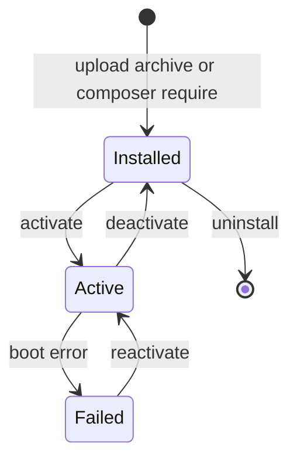

A plugin moves through a small set of states. Aikeedo drives the transitions from the admin panel, and your plugin can react to each one with a lifecycle hook.

## States

| Status | Meaning |
| --- | --- |
| `inactive` | Installed, not booted. Every fresh installation starts here. |
| `active` | Booted on every request. |
| `failed` | The plugin crashed while booting, and Aikeedo skips it until it's reactivated. See [Debugging](/development/plugins/debugging). |

The current status lives in `extra.status` in your `composer.json`. Aikeedo writes that value when an administrator activates or deactivates the plugin, so don't manage it yourself.

## Lifecycle



### Install

An administrator uploads an archive under **Plugins → Install**, or you run `composer require` yourself. For an upload, Aikeedo:

1. Validates the archive by reading `composer.json` at its root.
2. Moves the archive into `extra/artifacts/`, which is a Composer artifact repository.
3. Backs up any existing installation of that package to `var/plugin-backup/{uuid}` and removes the old directory.
4. Runs `composer require <name>:<version>`, which installs the package into `extra/extensions/{vendor}/{name}` and copies `extra.public` files to the web root.
5. Forces the status to `inactive`.
6. Calls your `install()` hook.
7. Clears the application cache.

If any step fails, the backup is restored, so a failed upgrade doesn't leave a broken install behind.

### Activate and deactivate

Toggling a plugin writes the new status to `composer.json`, calls `activate()` or `deactivate()`, clears the recorded health failure when activating, and clears the cache.

<Note>
  Hooks run inside the current request, but `boot()` doesn't. Your plugin starts registering routes, templates and services on the **next** request.
</Note>

### Update

There's no separate update step. Installing a newer archive of the same package replaces it, going through the same backup, install and hook sequence. When Aikeedo itself is updated, every installed plugin is reinstalled through Composer so its autoloader and public assets are rebuilt.

### Uninstall

Uninstalling calls `uninstall()`, runs `composer remove`, deletes `extra/extensions/{vendor}/{name}`, removes the published files recorded for the package, clears its health record and clears the cache.

<Warning>
  Uninstalling doesn't remove your options, or any rows you wrote into core tables. Clean up in `uninstall()` if that matters for your plugin.
</Warning>

## Hooks

Implement any combination of these interfaces on your entry class. Each method receives the plugin's `Context`.

| Interface | Method | Runs when |
| --- | --- | --- |
| `Plugin\Domain\Hooks\InstallHookInterface` | `install(Context $context): void` | Right after the package is installed |
| `Plugin\Domain\Hooks\ActivateHookInterface` | `activate(Context $context): void` | When an administrator activates the plugin |
| `Plugin\Domain\Hooks\DeactivateHookInterface` | `deactivate(Context $context): void` | When an administrator deactivates the plugin |
| `Plugin\Domain\Hooks\UninstallHookInterface` | `uninstall(Context $context): void` | Before the package is removed |

```php src/Plugin.php
<?php

declare(strict_types=1);

namespace Acme\Hello;

use Option\Application\Commands\DeleteOptionCommand;
use Option\Application\Commands\SaveOptionCommand;
use Override;
use Plugin\Domain\Context;
use Plugin\Domain\Hooks\InstallHookInterface;
use Plugin\Domain\Hooks\UninstallHookInterface;
use Plugin\Domain\PluginInterface;
use Shared\Infrastructure\CommandBus\Dispatcher;

class Plugin implements
    PluginInterface,
    InstallHookInterface,
    UninstallHookInterface
{
    public function __construct(
        private Dispatcher $dispatcher,
    ) {}

    #[Override]
    public function boot(Context $context): void
    {
        // Register routes, templates and services here.
    }

    #[Override]
    public function install(Context $context): void
    {
        // Seed default settings on first install.
        $this->dispatcher->dispatch(new SaveOptionCommand(
            'hello',
            json_encode(['greeting' => 'Hello'])
        ));
    }

    #[Override]
    public function uninstall(Context $context): void
    {
        // Remove everything this plugin stored.
        $this->dispatcher->dispatch(new DeleteOptionCommand('hello'));
    }
}
```

### Rules for hook code

- **Keep hooks idempotent.** A plugin can be installed over an existing copy, and reactivated many times.
- **Don't assume `boot()` ran.** Hooks run in a request where your plugin may not be active, so don't rely on services you register in `boot()`.
- **Fail loudly, but clean up.** An exception in `install()` aborts the installation and restores the backup, which is what you want if your setup can't complete.
- **Don't do slow work.** Hooks run inside an admin request. Schedule long tasks on cron instead. See [Events and cron](/development/plugins/events-and-cron).

## The Context object

Every hook and `boot()` receives `Plugin\Domain\Context`, the parsed manifest:

| Property | Description |
| --- | --- |
| `type` | `Type::PLUGIN` or `Type::THEME` |
| `name` | Package name value object |
| `version`, `description`, `homepage`, `releasedAt` | Top-level manifest metadata |
| `title`, `tagline`, `logo`, `icon`, `defaultUrl` | Values from `extra` |
| `entryClass` | The configured entry class |
| `supportChannels`, `licenses`, `authors` | Support and licensing metadata |
| `health` | The recorded boot failure, or `null` |
| `getStatus()` / `setStatus()` | Read or write `extra.status` |

```php
public function boot(Context $context): void
{
    $version = (string) $context->version->value;
}
```

<Warning>
  `Context` carries metadata only. To reach application services, type-hint them in your constructor. See [Dependency injection](/development/plugins/dependency-injection-and-services).
</Warning>

## Boot order

Plugins boot after every core module bootstrapper, so all core registries exist by then. Within `boot()`:

- Register templates, routes, listeners and services.
- Read options if you need to decide what to register.
- Don't run queries, HTTP calls or migrations. `boot()` runs on every web, console and cron request.

## Related

- [Plugin overview](/development/plugins/overview)
- [Manifest reference](/development/plugins/manifest)
- [Debugging](/development/plugins/debugging)
- [Packaging and distribution](/development/plugins/packaging-and-distribution)
