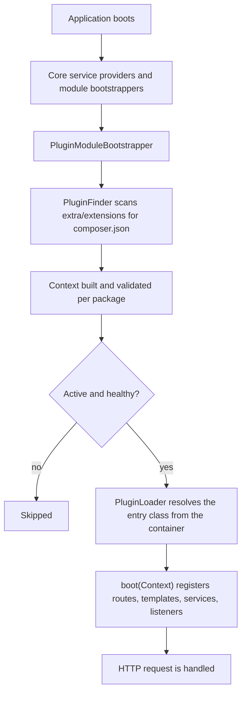

import DevVersionNote from '/snippets/dev-version-note.mdx';

A plugin is a Composer package that Aikeedo loads at boot. It can add pages, API endpoints, settings screens, navigation items, scheduled work and integrations, and it can plug new implementations into the core's extension points, without you editing a single core file.

<DevVersionNote />

## Anatomy of a plugin

```text
extra/extensions/acme/hello/
├── composer.json          # package metadata; type: aikeedo-plugin
├── src/
│   └── Plugin.php         # entry class; implements PluginInterface
├── templates/             # Twig templates (any layout you like)
└── locale/                # translation catalogs
```

Two things make it a plugin:

1. `composer.json` declares `"type": "aikeedo-plugin"`, requires `heyaikeedo/composer`, and names an entry class in `extra.entry-class`.
2. The entry class implements `Plugin\Domain\PluginInterface`:

```php src/Plugin.php
<?php

declare(strict_types=1);

namespace Acme\Hello;

use Override;
use Plugin\Domain\Context;
use Plugin\Domain\PluginInterface;
use Twig\Loader\FilesystemLoader;

class Plugin implements PluginInterface
{
    public function __construct(
        private FilesystemLoader $loader,
    ) {}

    #[Override]
    public function boot(Context $context): void
    {
        $this->loader->addPath(__DIR__ . '/../templates', 'acme-hello');
    }
}
```

The entry class is resolved from the dependency injection container, so **anything you type-hint in the constructor is injected**. That is how a plugin reaches the core: you ask for a registry, a collection or a mapper, and you register your own implementations inside `boot()`.

<Note>
  `Context` is read-only metadata about your package, built from its `composer.json`. It has no container or event dispatcher on it. Use constructor injection instead.
</Note>

## How a plugin is loaded



Key points:

- Plugins boot **after** every core module, so all core registries exist by the time `boot()` runs.
- `boot()` runs on every request, including console and cron runs. Keep it cheap: register things, don't do work.
- Only plugins whose status is `active` boot. Themes are a special case: a theme is active when it's the selected theme.
- If a plugin crashes while booting, Aikeedo records the failure in `var/plugin-health.json` and skips the plugin on later requests, so one broken plugin can't take the site down. With `DEBUG` on, the error is raised instead. See [Debugging](/development/plugins/debugging).

## What plugins can extend

| Capability | Where to start |
| --- | --- |
| Admin settings pages | [Admin settings pages](/development/plugins/admin-settings-pages) |
| Pages and JSON endpoints for signed-in users | [App pages and APIs](/development/plugins/app-pages-and-apis) |
| Public, unauthenticated endpoints and embeds | [Public endpoints and embeds](/development/plugins/public-endpoints-and-embeds) |
| Menu entries in the app and admin panel | [Navigation](/development/plugins/navigation) |
| Reactions to domain events, and scheduled work | [Events and cron](/development/plugins/events-and-cron) |
| Payment gateways | [Payment gateways](/development/plugins/guides/payments/overview) |
| Tax engines | [Tax engines](/development/plugins/guides/tax-engine) |
| Storage backends | [Storage adapters](/development/plugins/guides/storage-adapter) |
| Vector databases | [Vector stores](/development/plugins/guides/vector-store) |
| AI providers and models | [AI providers](/development/plugins/guides/ai-provider) |
| Chat tools | [AI tools](/development/plugins/guides/ai-tool) |
| Currency exchange rates | [Currency rate providers](/development/plugins/guides/currency-rate-provider) |
| Per-plan settings | [Plan config extensions](/development/plugins/guides/plan-config-extension) |
| Conversation import sources | [Import adapters](/development/plugins/guides/import-adapter) |
| Your own extension points, for other plugins to implement | [Custom extension points](/development/plugins/custom-extension-points) |

## What plugins cannot do

| Limitation | Why | What to do instead |
| --- | --- | --- |
| Add Doctrine entities | Doctrine maps only the core `src/` directory | Store data in options, reuse core entities, or use your own external store. See [Data and persistence](/development/plugins/data-and-persistence) |
| Add database migrations | Migration paths are fixed in `config/migrations.php` | Create any schema you need from an install hook against your own connection, or avoid extra tables |
| Add console commands | The command map in `config/commands.php` is static | Expose the action as an admin endpoint, or run it from cron |
| Replace core templates | Themes and plugins add namespaces, they don't override core paths | Use `resources/views/overrides/`. See [Extending Aikeedo](/development/extending-aikeedo) |

## Where plugins live

| Path | Contents |
| --- | --- |
| `extra/extensions/{vendor}/{name}` | The installed package, where Composer puts it |
| `extra/artifacts/` | Uploaded plugin archives, used as a Composer artifact repository |
| `public/e/{vendor}/{name}` | Public assets copied from `extra.public`. See [Public assets](/development/plugins/public-assets) |
| `var/plugin-backup/` | Backups taken before a reinstall |
| `var/plugin-health.json` | Recorded boot failures |

## Next steps

<CardGroup cols={2}>
  <Card title="Build your first plugin" icon="rocket" href="/development/plugins/quickstart">
    A working plugin with a settings page and a menu item, step by step.
  </Card>
  <Card title="Manifest reference" icon="file-code" href="/development/plugins/manifest">
    Every `composer.json` field Aikeedo reads.
  </Card>
  <Card title="Lifecycle and hooks" icon="refresh" href="/development/plugins/lifecycle-and-hooks">
    Install, activate, deactivate, uninstall and update.
  </Card>
  <Card title="Services you can inject" icon="vaccine" href="/development/plugins/dependency-injection-and-services">
    The core services a plugin reaches through its constructor.
  </Card>
</CardGroup>

import Support from '/snippets/support.mdx';

<Support />
