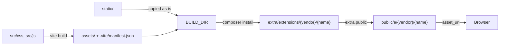

The starter kit builds CSS and JavaScript with Vite, copies the package files into the installed theme, and publishes the result to the web root. Understanding that chain makes asset problems easy to diagnose.

## The pipeline



## Configuration

Two environment variables drive it:

| Variable | Meaning |
| --- | --- |
| `BUILD_DIR` | Where the build writes. Point it at the installed theme directory, `extra/extensions/{vendor}/{name}`. |
| `AIKEEDO_SERVER` | The Aikeedo origin the dev server proxies to, such as `http://localhost:8000` |

The starter commits a `.env` with defaults. Put your machine's paths in `.env.local`, which is ignored by git.

<Warning>
  The production build empties `BUILD_DIR` first. Never point it at the installation root, the web root, or any directory that holds files you didn't build.
</Warning>

## Development

```bash
npm run dev
```

The dev server:

- Serves on port **5174**, with a fixed port so `THEME_ASSETS_SERVER` stays valid.
- Proxies everything except its own paths to `AIKEEDO_SERVER`, so you browse the real site through Vite.
- Serves `/assets/...` from your local `static/` when the file exists, and proxies it otherwise.
- Copies `static/**` into `BUILD_DIR` continuously, so template changes reach the installation.
- Full-reloads the page when a `.twig` or a `.po` file changes.

On the Aikeedo side, set `THEME_ASSETS_SERVER` to the dev server:

```ini .env
THEME_ASSETS_SERVER=http://localhost:5174
```

CSS updates apply without a reload. JavaScript and template changes trigger a full reload.

## Production build

```bash
npm run build
```

This writes the compiled bundles into `BUILD_DIR/assets/` with hashed filenames, copies `static/` alongside them, and writes `BUILD_DIR/.vite/manifest.json` mapping source paths to built files.

Remove `THEME_ASSETS_SERVER` from the Aikeedo `.env` afterwards, or the site keeps looking for a dev server that isn't running.

## How asset URLs resolve

`asset_url` is the filter every theme template uses:

```twig
<link rel="stylesheet" href="{{ '/src/css/index.css' | asset_url }}">

```

It resolves in this order:

<Steps>
  <Step title="A full URL is returned unchanged">
    `{{ 'https://cdn.example.com/x.png' | asset_url }}` stays as it is.
  </Step>
  <Step title="THEME_ASSETS_SERVER wins when set">
    The path is appended to that server, which is what makes hot reloading work.
  </Step>
  <Step title="The Vite manifest is consulted">
    A path listed in `public/e/{theme}/.vite/manifest.json`, such as `src/css/index.css`, becomes the hashed built file under `/e/{theme}/`.
  </Step>
  <Step title="Otherwise it falls back to assets/">
    The path is prefixed with `assets/` if needed and served from `/e/{theme}/assets/...`, with the application version as a cache-busting query.
  </Step>
</Steps>

<Note>
  `asset_url` is the theme filter. The similar `asset` filter resolves the **application's** own bundles and isn't for theme files.
</Note>

## Publishing files to the web root

The manifest decides what reaches the browser:

```json composer.json
{
  "extra": {
    "public": ["assets", ".vite"]
  }
}
```

Those entries are copied to `public/e/{vendor}/{name}/` when the theme is installed or updated. A theme that publishes nothing has no CSS or JavaScript in production, even though the files exist in `extra/extensions/`.

## Styling

The starter uses Tailwind CSS 3 with CSS variables, so colors can change per mode:

```javascript tailwind.config.js
export default {
  content: ['!./node_modules/**/*', './**/*.twig', './src/**/*.{js,css}'],
  darkMode: ['class', '[data-mode="dark"]'],
  theme: {
    extend: {
      colors: {
        main: 'rgb(var(--color-main) / <alpha-value>)',
        content: 'rgb(var(--color-content) / <alpha-value>)',
      },
    },
  },
};
```

The variables themselves are defined in a snippet, which is also where you switch them for dark mode. See [Dark mode and colors](/development/themes/dark-mode-and-colors).

<Note>
  Themes run their own Tailwind build, independent of the application's. The application uses Tailwind 4 and Vite 8; the starter uses Tailwind 3 and Vite 5. Your theme's versions are yours to choose, as long as the output is plain CSS and JavaScript.
</Note>

## Packaging

| Command | Result |
| --- | --- |
| `npm run dev` | Dev server with hot reloading |
| `npm run build` | Production build into `BUILD_DIR` |
| `npm run serve` | Preview the production build |
| `npm run pack` | `theme.zip`, installable through the admin panel |
| `npm run release` | A versioned archive containing `theme.zip` plus `release/` |

See [Packaging and publishing](/development/themes/packaging-and-publishing).

## Troubleshooting

<AccordionGroup>
  <Accordion title="Styles are missing in production">
    `extra.public` must include `assets` and `.vite`, and the theme must have been installed or reinstalled after the build so the files were copied.
  </Accordion>
  <Accordion title="The site keeps requesting localhost:5174">
    `THEME_ASSETS_SERVER` is still set in the Aikeedo `.env`. Remove it outside development.
  </Accordion>
  <Accordion title="Changes to a template do nothing">
    Either the dev server isn't copying to `BUILD_DIR`, or the Twig cache is on. Check `BUILD_DIR`, and set `CACHE=false`.
  </Accordion>
  <Accordion title="The build wiped files I needed">
    `emptyOutDir` clears `BUILD_DIR` on every build. Keep it pointed at the theme directory only.
  </Accordion>
</AccordionGroup>

## Related

- [Theme structure](/development/themes/structure)
- [Templates and layouts](/development/themes/templates-and-layouts)
- [Packaging and publishing](/development/themes/packaging-and-publishing)
