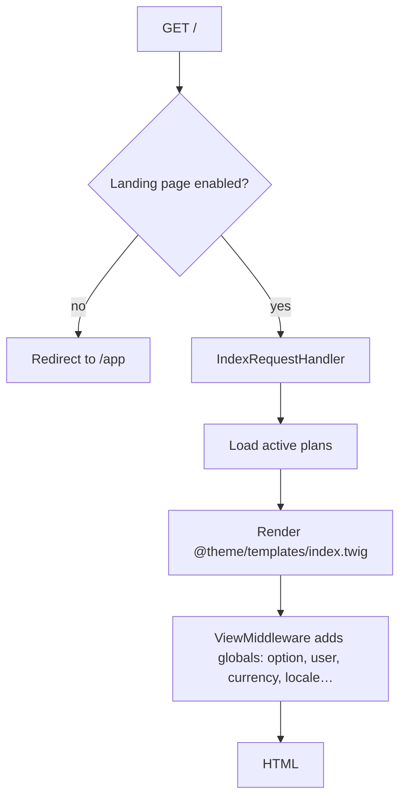

import { OfficialPlugins } from '/snippets/official-plugins.mdx';
import DevVersionNote from '/snippets/dev-version-note.mdx';

A theme is a Composer package that renders your public website. It owns the landing page, and it can add public pages of its own. Everything behind the login screen belongs to the application.

<DevVersionNote />

## What a theme controls

| Page | Rendered by |
| --- | --- |
| Landing page, `/` | **Your theme**, from `templates/index.twig` |
| Extra public pages, such as `/features` | **Your theme**, if it registers routes through an entry class |
| Login, signup, password recovery | Core templates |
| Policy pages, such as `/policies/terms` | Core templates, with content from admin settings |
| The app, `/app`, and the admin panel | Core templates |
| 404 and error pages | Core templates |

<Note>
  To change a core template, use `resources/views/overrides/`, which isn't part of the theme system. See [Extending Aikeedo](/development/extending-aikeedo).
</Note>

## How rendering works



- The active theme is the package named by the `theme` option, which defaults to the bundled default theme. Publishing a theme in **Admin → Themes** sets it.
- `@theme` is a Twig namespace pointing at the active theme's directory, so every include in your templates starts with `@theme/`.
- The landing page receives `plans`, the active plans sorted by price. Every other global comes from the view middleware.
- `site.is_landing_page_enabled` turns the landing page off, which redirects `/` to the app.

## Preview before publishing

`/preview?theme=vendor/name` sets a short-lived preview cookie and sends you to the home page, so you can look at a theme without switching the live site.

## Anatomy

```text
extra/extensions/acme/aurora/
├── composer.json          # type: aikeedo-theme
├── templates/
│   └── index.twig         # the landing page
├── layouts/
├── sections/
├── snippets/
├── assets/                # built CSS, JS and images
├── .vite/manifest.json    # written by the build
├── src/                   # optional PHP entry class and page handlers
└── locale/                # translation catalogs, theme domain
```

Only `composer.json` and `templates/index.twig` are required. Everything else is convention, plus whatever your build produces. See [The minimum theme](/development/themes/minimum-theme).

## Where themes come from

| Approach | Use when |
| --- | --- |
| [The starter kit](/development/themes/quickstart) | You're building a new theme. It ships the build pipeline, a layout, custom elements and catalogs. |
| [Copy the default theme](/development/themes/customizing-existing-themes) | You want the shipped design with changes. Always rename it, or an update overwrites your work. |
| From scratch | You want full control and no build step. Start from the minimum theme. |

Want a finished design instead of building one? The official Pulse theme is available on the [Aikeedo Marketplace](https://aikeedo.com/marketplace/):

<OfficialPlugins skus={['pulse']} />

## Theme development at a glance

<CardGroup cols={2}>
  <Card title="Quickstart" icon="rocket" href="/development/themes/quickstart">
    Clone the starter kit and get hot reloading against a local installation.
  </Card>
  <Card title="Structure" icon="folders" href="/development/themes/structure">
    What every directory and file is for.
  </Card>
  <Card title="Template objects" icon="braces" href="/development/themes/template-objects">
    Every variable available in a theme template.
  </Card>
  <Card title="Custom pages" icon="file-plus" href="/development/themes/custom-pages">
    Add public pages with a PHP entry class.
  </Card>
</CardGroup>

import Support from '/snippets/support.mdx';

<Support />
